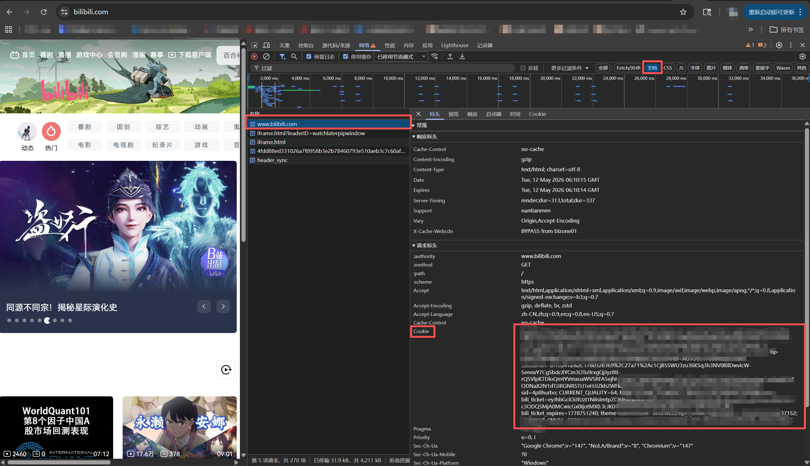
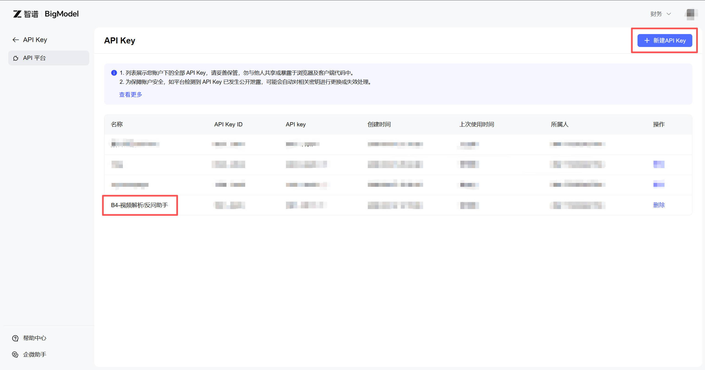

<div align="center">
  <h1>Video Knowledge API</h1>
  <p><strong>YouTube / Bilibili 视频字幕与画面理解 API</strong></p>
</div>

<p align="center">
  
  
  
  
</p>

---

## 🎬 项目简介

Video Knowledge API 是一个基于 FastAPI 开发的轻量视频解析服务，可以把 YouTube 或 Bilibili 视频链接解析为结构化 JSON，返回视频元信息、时间轴字幕、纯文本字幕、分块文本，并可按需启用 GLM-ASR 音频转写和 GLM 视觉解析。

项目参考并致谢：

- [BiliNote](https://github.com/JefferyHcool/BiliNote)：字幕优先、登录态 Cookie、视频帧拼图理解等设计思路
- [yt-dlp](https://github.com/yt-dlp/yt-dlp)：视频元信息、字幕轨道、音频和视频下载能力
- [youtube-transcript-api](https://github.com/jdepoix/youtube-transcript-api)：YouTube 字幕读取能力
- [FastAPI](https://fastapi.tiangolo.com/)：API 服务和 OpenAPI 文档

主要能力：

- 优先读取平台已有字幕，保留时间轴信息
- 支持 YouTube 人工字幕和自动生成字幕
- 支持 Bilibili 官方字幕和 AI 字幕
- 支持保存 Bilibili Cookie，用于读取需要登录态的 AI 字幕
- 支持平台字幕缺失时用 GLM-ASR 做语音转文字
- 支持下载低清视频、抽取静态帧、拼成网格图，并用 GLM 视觉模型理解画面
- 支持同步接口返回 `ok / error / warnings / dify_payload`，便于工作流直接读取字段

## 📁 项目结构

```text
video-knowledge-api/
├── api/              # HTTP 路由
├── app/              # 平台适配与基础能力
├── config/           # 统一配置读取
├── core/             # 应用创建和统一错误处理
├── models/           # 数据结构导出
├── services/         # 业务编排、Cookie、缓存、视觉解析
├── static/           # 临时静态目录占位
├── assets/           # README 图片
├── .env.example      # 配置模板
├── Dockerfile
├── main.py           # 统一启动入口
└── requirements.txt
```

## 🚀 打开方式一：GitHub Codespaces

推荐使用 GitHub Codespaces。打开仓库页面后：

1. 点击 `Code`
2. 选择 `Codespaces`
3. 点击 `Create codespace on main`
4. 等待依赖安装完成
5. 打开 `Ports` 面板，找到 `8000`
6. 将 Visibility 改为 `Public`
7. 复制形如 `https://你的-codespace-名字-8000.app.github.dev` 的公网地址

Codespaces 会自动执行：

```bash
pip install -r requirements.txt
python main.py
```

如果服务没有自动启动，可以手动运行：

```bash
python main.py
```

查看启动日志：

```bash
tail -f /tmp/video-knowledge-api.log
```

健康检查：

```bash
curl https://你的-codespace-名字-8000.app.github.dev/health
```

返回示例：

```json
{
  "ok": true,
  "service": "video-knowledge-api",
  "version": "0.2.0",
  "ffmpeg": true,
  "glm_configured": false,
  "bilibili_cookie_configured": false
}
```

在线接口文档：

```text
https://你的-codespace-名字-8000.app.github.dev/docs
```

## 💻 打开方式二：本地 Python

准备 Python 3.12，并确认已经安装 `ffmpeg`：

```bash
ffmpeg -version
```

安装依赖并启动：

```bash
python -m venv .venv
.venv\Scripts\activate
pip install -r requirements.txt
copy .env.example .env
python main.py
```

macOS / Linux 可以把激活命令换成：

```bash
source .venv/bin/activate
cp .env.example .env
python main.py
```

启动后访问：

```text
http://127.0.0.1:8000/docs
```

## 🐳 打开方式三：Docker

Docker 适合有经验的开发者：

```bash
docker build -t video-knowledge-api .
docker run --rm -p 8000:8000 --env-file .env video-knowledge-api
```

## ⚙️ 配置说明

复制配置模板：

```bash
copy .env.example .env
```

常用配置：

| 配置 | 说明 |
| --- | --- |
| `PORT` | 服务端口，默认 `8000` |
| `CORS_ALLOW_ORIGINS` | 浏览器跨域来源，默认 `*` |
| `REQUEST_TIMEOUT_SECONDS` | 单次同步请求最大等待时间 |
| `MAX_CONCURRENT_TASKS` | 同时处理的视频任务数量 |
| `COOKIE_STORE_PATH` | Bilibili Cookie 保存位置 |
| `CACHE_ROOT` | 音频、视频、关键帧临时缓存目录 |
| `KEEP_CACHE` | 调试时保留缓存文件，默认 `false` |
| `GLM_API_KEY` | 开启 GLM-ASR 或视觉解析时需要 |
| `YTDLP_COOKIES_FILE` | 进阶用法，指定 Netscape 格式 Cookie 文件 |

`.env`、`.secrets/`、`.cache/`、`*.cookies.txt` 已写入 `.gitignore`。

## 📚 字幕解析接口

推荐使用同步接口：

```http
POST /api/generate_note
```

兼容接口：

```http
POST /v1/video/extract
POST /v1/video/generate_note
```

基础请求：

```json
{
  "url": "https://www.bilibili.com/video/BVxxxxxx",
  "languages": ["zh-Hans", "zh-CN", "zh", "en"],
  "include_metadata": true,
  "max_chars_per_chunk": 5000
}
```

常用参数：

| 参数 | 说明 |
| --- | --- |
| `url` | YouTube 或 Bilibili 视频链接 |
| `languages` | 字幕语言优先级 |
| `include_metadata` | 返回标题、时长、作者等信息 |
| `max_chars_per_chunk` | 单个文本分块最大字符数 |
| `fallback_to_glm_stt` | 没有平台字幕时启用 GLM-ASR |
| `include_visual_analysis` | 启用 GLM 视觉解析 |
| `include_keyframes` | 只抽取关键帧和拼图，不调用视觉模型 |
| `frame_interval` | 每隔多少秒抽取一帧，默认 `6`，长视频可调大以减少 GLM 调用 |
| `grid_size` | 拼图布局，默认 `[2, 2]` |
| `max_keyframes` | 最多抽取多少帧，默认 `16` |

成功响应会包含：

```json
{
  "ok": true,
  "platform": "bilibili",
  "metadata": {},
  "transcript": {},
  "visual_analysis": null,
  "dify_payload": {
    "title": "视频标题",
    "timeline_text": "[00:00:00 - 00:00:03] 字幕文本",
    "plain_text": "完整字幕文本",
    "chunks": [],
    "visual_summary": ""
  },
  "warnings": []
}
```

失败响应会保留相同 JSON 结构，并使用标准 HTTP 状态码，例如参数错误返回 `422`，无字幕返回 `404`，处理超时返回 `504`：

```json
{
  "ok": false,
  "platform": "bilibili",
  "error": "NO_TRANSCRIPT",
  "warnings": ["No usable subtitle/timeline track found."],
  "dify_payload": {
    "timeline_text": "",
    "plain_text": "",
    "chunks": []
  }
}
```

## 🎞️ YouTube 字幕读取

YouTube 字幕优先使用 `youtube-transcript-api`，会按 `languages` 顺序查找字幕，先读人工字幕，再读自动生成字幕；如果读取失败，会再使用 `yt-dlp` 尝试读取字幕轨道和自动字幕轨道。

YouTube 字幕读取主要受视频字幕可用性和网络环境影响。

## 🍪 Bilibili 字幕与登录态

Bilibili 字幕优先通过官方接口读取，优先读取官方字幕和 AI 字幕；字幕需要登录态时，服务会使用已保存的 Bilibili Cookie，官方接口失败时再使用 `yt-dlp` 尝试读取字幕轨道。

Bilibili AI 字幕需要 Cookie 登录态。浏览器登录 Bilibili 后可以看到字幕，API 读取字幕时也需要同一份登录态。

### 网页端提取 Cookie

推荐使用 Chrome 或 Edge 浏览器：

1. 打开 Bilibili 网页版
2. 登录自己的 Bilibili 账号
3. 进入 Bilibili 首页
4. 按 `F12` 打开开发者工具
5. 点击 `Network` 或 `网络`
6. 点击 `文档`，也可能显示为 `Doc` 或 `Document`
7. 刷新页面
8. 在左侧请求列表里点击 `www.bilibili.com`
9. 点击右侧的 `Headers` 或 `标头`
10. 找到 `Request Headers` 或 `请求标头`
11. 找到 `Cookie`
12. 复制 `Cookie:` 后面的完整内容

<p align="center">
  
</p>

Cookie 通常包含：

```text
SESSDATA=xxx; bili_jct=xxx; DedeUserID=xxx
```

Cookie 属于个人登录凭证，请妥善保存。泄露后建议退出 Bilibili 登录或刷新登录态。

### 写入 Bilibili Cookie

```bash
curl -X POST "https://你的-codespace-名字-8000.app.github.dev/v1/auth/cookies" \
  -H "Content-Type: application/json" \
  -d '{
    "platform": "bilibili",
    "cookie": "SESSDATA=xxx; bili_jct=xxx; DedeUserID=xxx"
  }'
```

PowerShell 示例：

```powershell
Invoke-RestMethod `
  -Method Post `
  -Uri "https://你的-codespace-名字-8000.app.github.dev/v1/auth/cookies" `
  -ContentType "application/json" `
  -Body '{"platform":"bilibili","cookie":"SESSDATA=xxx; bili_jct=xxx; DedeUserID=xxx"}'
```

查看 Cookie 状态：

```bash
curl "https://你的-codespace-名字-8000.app.github.dev/v1/auth/cookies/bilibili"
```

如果 `required_keys_missing` 是空数组，说明关键字段已经齐全。

## 🧠 GLM-ASR 与视觉解析

只读取平台字幕时，不需要 `GLM_API_KEY`。启用 GLM-ASR 或视觉解析前，需要在运行环境中配置：

```bash
export GLM_API_KEY="换成你的智谱 API Key"
python main.py
```

PowerShell：

```powershell
$env:GLM_API_KEY="换成你的智谱 API Key"
python main.py
```

<p align="center">
  
</p>

启用 GLM-ASR：

```json
{
  "url": "https://www.bilibili.com/video/BVxxxxxx",
  "fallback_to_glm_stt": true
}
```

启用视觉解析：

```json
{
  "url": "https://www.bilibili.com/video/BVxxxxxx",
  "include_visual_analysis": true,
  "frame_interval": 6,
  "grid_size": [2, 2],
  "max_keyframes": 16
}
```

视觉解析流程：

```text
yt-dlp 下载低清视频
-> ffmpeg 每 6 秒抽取静态帧
-> Pillow 将 4 张帧拼成 2x2 网格图
-> GLM 视觉模型分析拼图
```

## 🔗 Dify 接入

1. 在 Codespaces 启动服务，并把 `8000` 端口设为 `Public`
2. 复制公网地址，例如 `https://xxx-8000.app.github.dev`
3. 在 Dify Workflow 或 Chatflow 中添加 HTTP Request 节点
4. Method 选择 `POST`
5. URL 填：

```text
https://xxx-8000.app.github.dev/api/generate_note
```

6. Header 填：

```http
Content-Type: application/json
```

7. Body 填：

```json
{
  "url": "{{video_url}}",
  "languages": ["zh-Hans", "zh-CN", "zh", "en"],
  "include_metadata": true,
  "max_chars_per_chunk": 5000
}
```

后续节点优先读取：

| 字段 | 用途 |
| --- | --- |
| `ok` | 判断是否解析成功 |
| `error` | 失败原因 |
| `warnings` | 调试提示 |
| `dify_payload.title` | 视频标题 |
| `dify_payload.timeline_text` | 带时间轴字幕 |
| `dify_payload.plain_text` | 纯文本字幕 |
| `dify_payload.chunks` | 长视频分块文本 |
| `dify_payload.visual_summary` | 视觉解析摘要 |

长视频建议优先使用 `dify_payload.chunks` 分块处理，再合并每段结果。

## ⚠️ 注意事项 & 限制

- 支持平台：YouTube、Bilibili
- YouTube 字幕读取可能受网络环境影响
- Bilibili AI 字幕需要 Cookie 登录态
- 平台字幕可用性会影响解析结果
- GLM-ASR 和 GLM 视觉解析需要设置 `GLM_API_KEY`
- 视觉解析会下载低清视频并调用 GLM 视觉模型，耗时和额度消耗高于字幕读取
- 默认单次同步请求最长等待 `REQUEST_TIMEOUT_SECONDS` 秒，超时后会终止当前 worker 进程
- 默认同时处理 `MAX_CONCURRENT_TASKS` 个视频任务
- 临时缓存默认自动清理，调试时可设置 `KEEP_CACHE=true`

## 🛠️ 常见错误

| 错误 | 处理方式 |
| --- | --- |
| `/health` 访问失败 | 检查服务是否启动、端口是否 Public、URL 是否复制完整 |
| `NO_TRANSCRIPT` | 视频没有可读取字幕，Bilibili 可先配置 Cookie，或开启 GLM-ASR |
| `VALIDATION_ERROR` | 检查请求体字段类型，例如 `url` 必须是字符串 |
| `REQUEST_TIMEOUT` | 视频处理时间过长，减少视觉解析参数或提高超时时间 |
| `SERVER_BUSY` | 当前服务正在处理其他视频，稍后重试 |
| `GLM STT fallback failed` | 检查 `GLM_API_KEY` 是否配置正确 |
| `ffmpeg is required` | 安装 ffmpeg 后重新启动服务 |

## 🧾 接口列表

| 方法 | 路径 | 用途 |
| --- | --- | --- |
| `GET` | `/health` | 检查服务状态 |
| `POST` | `/api/generate_note` | 同步解析视频 |
| `POST` | `/v1/video/extract` | 同步解析视频，兼容接口 |
| `POST` | `/v1/video/generate_note` | 同步解析视频，兼容接口 |
| `POST` | `/v1/auth/cookies` | 保存 Cookie |
| `GET` | `/v1/auth/cookies/bilibili` | 查看 Cookie 状态 |
| `DELETE` | `/v1/auth/cookies/bilibili` | 删除 Cookie |
| `GET` | `/docs` | Swagger UI |
| `GET` | `/openapi.json` | OpenAPI 文档 |

## 📄 License

本项目采用 MIT License。详见 [LICENSE](LICENSE)。
